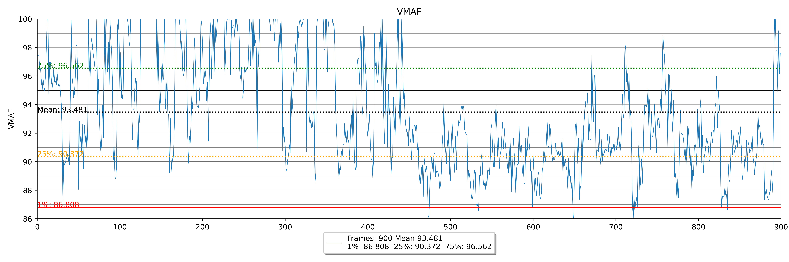

# Plot_Vmaf

Simple script for vmaf plotting and analysis. Provides tools for generating VMAF scores and creating visualizations of video quality metrics.



## Requirements

### System Dependencies
- FFmpeg with libvmaf support (for VMAF analysis)
- bc (for calculations in generate-vmaf)
- jq (for JSON processing)
- numpy
- matplotlib

On macOS, install dependencies with:
```bash
brew install ffmpeg libvmaf jq python numpy python-matplotlib
```

### Python Dependencies
- Python 3.7+
- pipx
- numpy
- matplotlib

## Installation

```bash
git clone https://github.com/five82/Plot_Vmaf.git
cd Plot_Vmaf
pipx install -e .
```

## Uninstall

```bash
# If installed with -e flag
pipx uninstall vmaf-tools

# Remove cloned directory
cd ..
rm -rf Plot_Vmaf
```

## Usage

### Generate VMAF Scores
The `generate-vmaf` command analyzes video quality by:
- Comparing a reference video with a processed/compressed version
- Handling resolution differences automatically
- Converting HDR to SDR if needed
- Using FFmpeg's libvmaf to calculate quality metrics
- Outputting detailed JSON data and visualization plots

```bash
# Basic usage (no denoising)
generate-vmaf reference.mp4 distorted.mp4

# With options
generate-vmaf --denoise --output-dir ~/results reference.mp4 distorted.mp4 my_analysis

# Just specify output prefix
generate-vmaf reference.mp4 distorted.mp4 comparison
```

### Plot VMAF Data
Visualize VMAF analysis results from JSON files:
```bash
# Basic usage
vmaf-plot my_analysis.json

# Specify output format
vmaf-plot my_analysis.json -o analysis.svg

# Compare multiple files
vmaf-plot analysis1.json analysis2.json -o comparison.png

# Plot specific metrics
vmaf-plot -m VMAF PSNR my_analysis.json
```

### Options

#### generate-vmaf
```
--denoise          Enable denoising of reference video
--output-dir DIR   Specify output directory (default: current directory)
[output_prefix]    Optional prefix for output files (default: vmaf_analysis)
```

#### vmaf-plot
```
-o, --output FILE   Graph output file (default: plot.png)
-m, --metrics       Metrics to plot (VMAF, PSNR, SSIM)
```

## Output Files
For each analysis, generate-vmaf produces:
- JSON file containing frame-by-frame quality metrics
- PNG plot visualizing the VMAF scores over time
- Support for multiple plot formats (png, svg, pdf)

## Acknowledgments

Based on Netflix's VMAF metric and FFmpeg's libvmaf implementation.